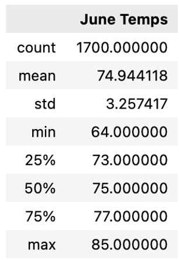
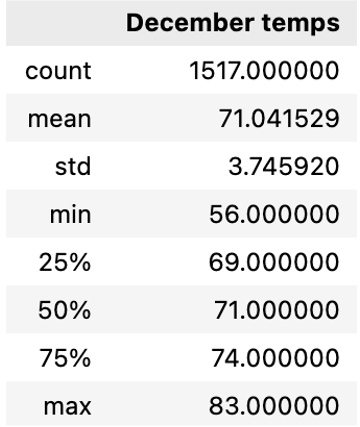

# Surf's up Challenge

## Module 9

### Overview of the Analysis

#### Purpose

The purpose of this analysis is to use Python, Pandas functions, and SQLAlchemy to filter the data from hawaii.sqlite and retrieve all of the temperates for the months of June and December. We convert this data to a list, create a DataFrame, and generate summary statistics.

#### Results

There are 3 key differences between the weather in June and December:

1. The maximum temperature for the June dates is 85 degrees, while December is 83.
2. The minimum temperature for the June dates is 64 degrees, while December is 56.
3. The standard deviation for June temps is 3.25 while for December temps it is 3.74. This means that the temperatures in June vary less than those in December.

#### Summary

Our summary statistics for the month of June:

Our summary statistics for the month of December:

Based on this data, this location is attractive as a location for our business.

We can look for additional weather data with queries that take into account:
1. which years have a greater range of temperatures, to make some predictions about the future
2. which other months may have constant beautiful temperatures and create tourist promotions based on those
